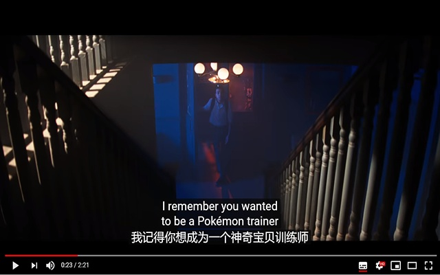
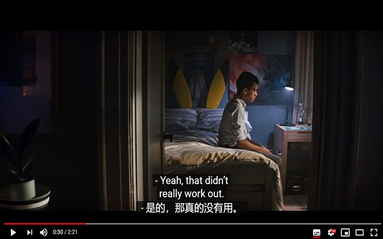
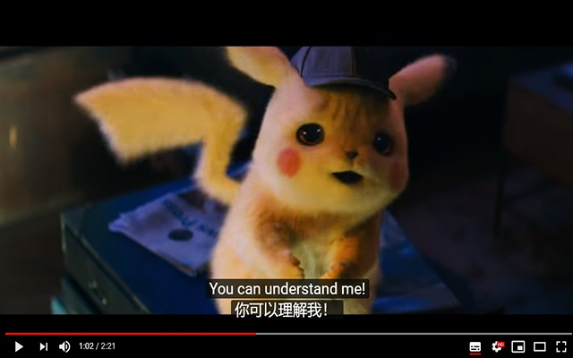

# YouTube™双字幕

> 点击一下即可开启中英双字幕,适用于YouTube™

# 安装

> ~~`(需要科学上网)`使用Chrome浏览器打开 [Chrome网上应用商店](https://chrome.google.com/webstore/detail/youtube%E5%8F%8C%E5%AD%97%E5%B9%95/pinbfcanggagdlikncmljamikccpkkon?hl=zh-CN)，点击`添加到Chrome`~~

> 因此扩展程序被莫名其妙的删除，目前暂不打算重新上架，需要使用的朋友可以使用开发者模式进行使用，操作步骤如下：

>   1、 点击`clone or download`下载zip文件到本地解压

>   1、 然后在Chrome浏览器打开`chrome://extensions/`

>   2、 点击`开发者模式`开启该模式

>   3、 点击`加载已解压的扩展程序`

>   4、 选择包含`manifest.json`的`youtube-captions`文件夹

# 实现原理

> 1、向`YouTube.com`注入一段`JS`

> 2、修改`XMLHttpRequest`对象，在上边挂一层`hook`

> 3、当`hook`检测到请求字幕文件`responseText`,去请求一遍中文的字幕然后修改`responseText`并返回

# 屏幕截图

 

 

 
